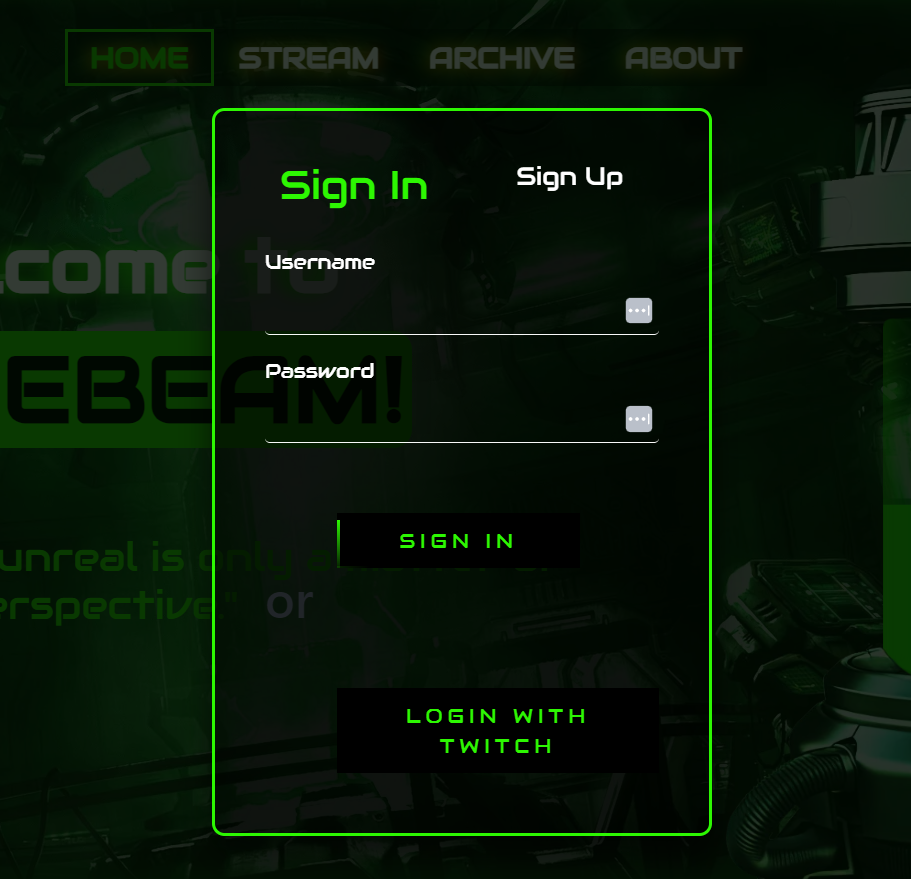
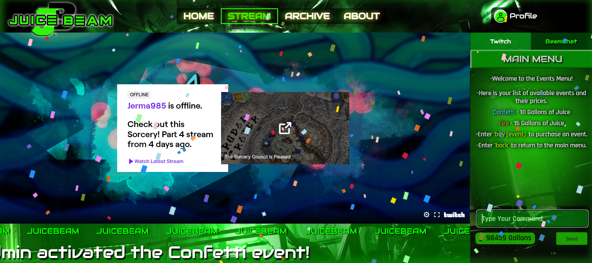
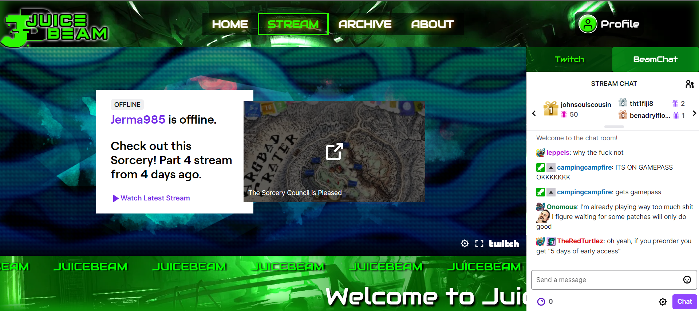
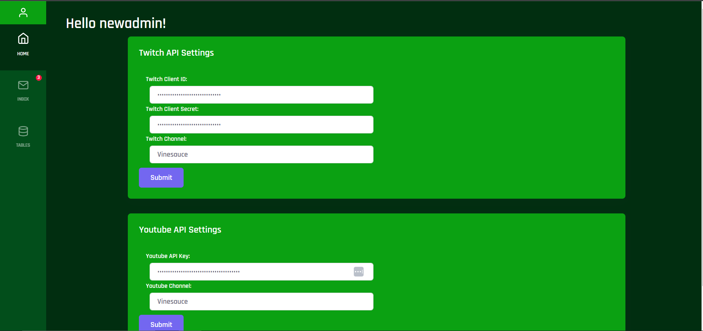
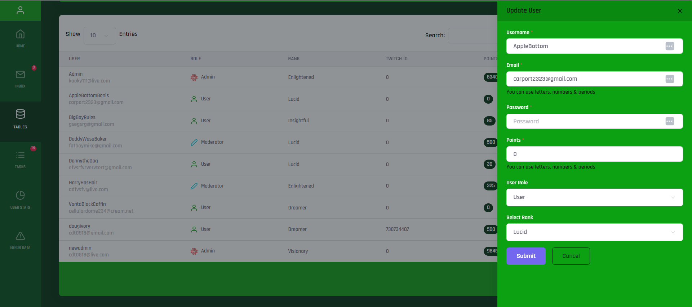

# JuiceBeam-Production

BeamChat API and Back-End

This repository incudes the following features:

- Built in Node.js
- User Registration, Login, and Authentication using JWT Tokens
- BeamChat Event Handler that queues user events and sends the current event to front end using Socket.io
- MySQL Database Management using Express and Sequelize
- Compiled front end that uses React for page building and Redux for state management.

# Introduction

JuiceBeam is meant to be a prototype of how a content creator could better interact with their audience. The core idea behind JuiceBeam is to showcase how aggregating a content creators social media presence into one simple site, and allowing them to run it themselves without them needing to be a programmer.

# User Interaction

Account Creation:
The user can create an account using either their email or their Twitch account. In order for the users to be able to login using their Twitch account, the owner of the site needs to obtain a client id and secret for Twitch's API and input those details into the administrator panel.



Points:
The site also experiments with "juice points" for users of the site. These points can be awarded per user from the administrator panel and can be used to play events on the stream page or upgrade the users "rank" once they have enough.

Events:
When users open the "Stream" page they are automatically connected to a websocket so that when one user initiates an event (ex. confetti raining down), every user connected to the page can see it simultaneosly.




# Content Aggregation

Via the administrator panel the owner of the site is able to change the Youtube channel and Twitch channel that the site will feature. 


Twitch:
Changing the Twitch Channel name displays that channel's embedded stream and chat on the "Stream" page.



Youtube:
Once the owner has entered a valid Youtube data API key, they can change the Youtube channel name and have the site automatically pull the thumbnails, titles and dates of the most recently uploaded videos and display them on the "Archive" page.


# Administrator Panel 

The administrator panel can be accessed by logging into a Juicebeam account that has their role designated as administrator. To access it after logging in, all they have to do is add "/admin" to the end of the sites home page url. 

API:
The administrator can change the api keys and secrets needed to for the site to function from the panel.



Management:
Through the administrator panel, the owner of the site can modify user data on the fly as well as view and update the Youtube video data stored in the database.



# Running the Project

Before attempting to run the project node.js and a MySQL server must already be running on the system.
The database information can be altered in the config.json file.

First the user must download the repository using the following command in the preferred folder:

```
git clone https://github.com/Archetypical/JuiceBeam-Production.git
```

Next the user must install the dependencies with the command:

```
npm install
```

Finally the user can start the project with the command:
```
npm start
```
